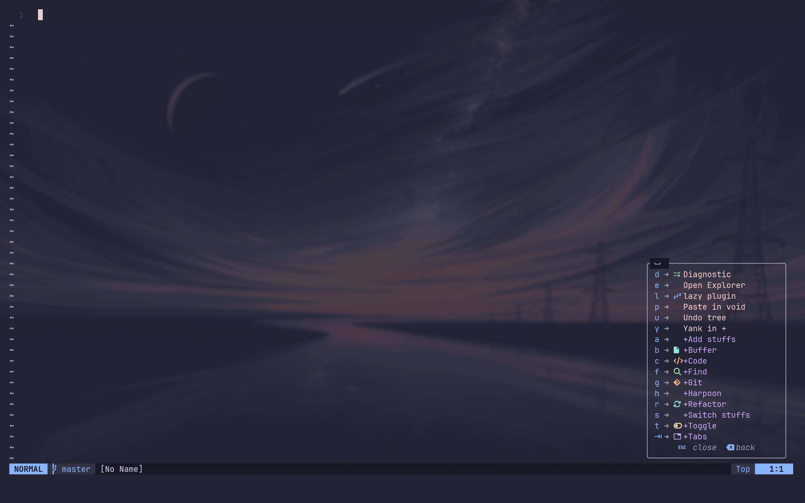

# Cleanvim

A modular, minimal, and transparent Neovim distribution built for clarity, explicit structure and predictable behavior.
It favors clean architecture over hidden abstraction and remains fast through lazy-loading.

<div align="center">
  
</div>

## Prerequisites

- **Neovim 0.11+**
- **A Nerd Font** (e.g., JetBrainsMono Nerd Font) for icons.

---

## Directory Structure

```
~/.config/cleanvim/
├── init.lua              # Entry point
├── lazy-lock.json       
├── LICENSE
└── lua/
    └── cleanvim/         # Main namespace
        ├── core/         # Options, keymaps, autocmds, commands
        ├── config/       # Defaults and saved state
        ├── plugins/      # Default plugin specifications
        ├── ui/           # Themes, transparency, diagnostics
        ├── custom/       # User overrides and extensions
        └── lazy.lua      # Plugin manager bootstrap
```

### Core Concepts

* **`core/`** – fundamental editor behavior 
* **`plugins/`** – default plugins 
* **`ui/`** – appearance-related configuration
* **`custom/`** – user playground
* **`config/save_state/`** – persisted state 

---

## Editor Control

Cleanvim provides built-in control for extending and modifying editor behavior without the need of editing core file.

| Action | Purpose                                                                            |
| ------ | ---------------------------------------------------------------------------------- |
| Add    | Extend functionality (themes, plugins, formatter, linter)                          |
| Switch | Change active style (theme, diagnostic style)                                      |
| Toggle | Enable or disable runtime behavior (invisibility, format-on-save, inline comments) |

## Installation

1. **Backup your existing Neovim config**

```bash
mv ~/.config/nvim ~/.config/nvim.bak
mv ~/.local/share/nvim ~/.local/share/nvim.bak
```

2. **Clone Cleanvim**

```bash
git clone https://github.com/Cyrus-Gahatraj/cleanvim ~/.config/nvim
```

3. **Start Neovim**

Lazy.nvim will bootstrap automatically on first launch.

---

### Included Plugins

Cleanvim ships with some of the plugins 

#### Core & UX

- [lazy.nvim](https://github.com/folke/lazy.nvim) – Plugin manager

- [which-key](https://github.com/folke/which-key.nvim) – Keybinding discovery

- [undotree](https://github.com/jiaoshijie/undotree) - Visual undo history

- [oil](https://github.com/stevearc/oil.nvim) - File explorer as a buffer

- [blink.cmp](https://github.com/Saghen/blink.cmp) - Autocomplete engine

- [lualine](https://github.com/nvim-lualine/lualine.nvim) - Statusline 

#### Editing (mini.nvim suite)

- [mini.ai](https://github.com/echasnovski/mini.ai) - Text objects

- [mini.comment](https://github.com/echasnovski/mini.comment) - Commenting

- [mini.pairs](https://github.com/echasnovski/mini.pairs) - Auto pairs

- [mini.surround](https://github.com/echasnovski/mini.surround) - Surround Action

- [mini.bracketed](https://github.com/echasnovski/mini.bracketed) - Bracket-based navigation

- [mini.cmdline](https://github.com/echasnovski/mini.cmdline) - Command-line enhancements

#### Navigation & Search

- [telescope.nvim](https://github.com/nvim-telescope/telescope.nvim) - Fuzzy finder

#### Git

- [gitsigns.nvim](https://github.com/lewis6991/gitsigns.nvim) - Git hunks and signs

- [vim-fugitive](https://github.com/tpope/vim-fugitive) - Git integration

- [lazygit.nvim](https://github.com/kdheepak/lazygit.nvim) - LazyGit integration

#### LSP & Tooling

- [nvim-lspconfig](https://github.com/neovim/nvim-lspconfig) - LSP configuration

- [mason.nvim](https://github.com/williamboman/mason.nvim) - LSP/DAP/tool installer

- [mason-tool-installer](https://github.com/WhoIsSethDaniel/mason-tool-installer.nvim) - Automates installation of external binaries 

- [conform.nvim](https://github.com/stevearc/conform.nvim) - Formatter
 
- [nvim-lint](https://github.com/mfussenegger/nvim-lint) - Linter

- [nvim-treesitter](https://github.com/nvim-treesitter/nvim-treesitter)

#### Themes

Built-in theme support with persistent selection:

- *Catppuccin*

- *Gruvbox*

- *Kanagawa*

- *Tokyonight*

- *Nord*

- *Rose Pine*

- *Everforest*

- *Monokai Pro*

- *Flexoki*

- *Bamboo*

- *Ethereal*

- *Matteblack*

- *Cyberdream*

--- 

## Customization

Cleanvim is designed to be extended without modifying core files.

### Add or Override Plugins

Place your plugins in:

```
lua/cleanvim/custom/plugins/
```

Or just use the keymap **\<leader\>ap**

### Keymaps & Options

* Core keymaps: `lua/cleanvim/core/keymaps.lua`
* Core options: `lua/cleanvim/core/options.lua`

### Themes

* Theme picker is built-in
* Selected theme is persisted automatically
* Themes live in `plugins/themes/`
* User theme can be added with **\<leader\>at**
* Snippets can be added with **\<leader\>as**

---

## Contributing

Cleanvim is currently in active development and **contributions are highly encouraged!** Whether it's a bug fix, a new feature, or improving documentation, feel free to get involved.

---

## License

MIT License © Cyrus Gahatraj

